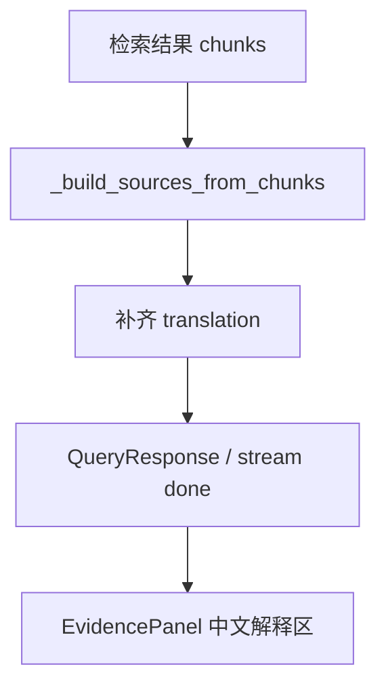

# 变更提案: source-translation-panel

## 元信息
```yaml
类型: 修复/优化
方案类型: implementation
优先级: P1
状态: 已确认
创建: 2026-03-27
```

---

## 1. 需求

### 背景
当前右侧“证据与溯源”面板已经预留了“中文解释”展示区，但在实时展示模式下，
后端流式接口返回的 `Source.translation` 被固定设置为空字符串，导致前端稳定显示“暂无翻译”。
这会让来源区只剩英文原文，削弱可读性和溯源价值。

### 目标
- 为来源面板中的每条 `source` 补充中文翻译内容。
- 保持现有前端布局和交互不变，优先修复后端数据链路。
- 统一普通问答和流式问答在 `Source.translation` 字段上的行为。

### 约束条件
```yaml
时间约束: 本次只处理 source 翻译链路，不扩展新的前端交互。
性能约束: 翻译补全不能显著放大流式接口尾延迟；需要限制 source 数量和文本长度。
兼容性约束: 保持 QueryResponse/StreamDonePayload 的字段结构兼容现有前端。
业务约束: 翻译应保留条款号、表格号、公式号等规范标识，不虚构原文外内容。
```

### 验收标准
- [ ] 流式问答返回的 `sources[].translation` 不再固定为空，来源面板可展示中文解释。
- [ ] 普通问答返回中若 LLM 未给出 `translation`，后端会自动补齐或兜底处理。
- [ ] 相关单元测试覆盖流式模式和空翻译回填场景。

---

## 2. 方案

### 技术方案
采用后端主修的最小实现方案：

1. 在生成层新增 source 翻译辅助函数，对检索结果构建出的 `Source` 列表进行批量中文翻译。
2. 在 `generate_answer_stream()` 的 `done` 事件发送前，对 `_build_sources_from_chunks()` 生成的 sources 执行翻译补全。
3. 在 `generate_answer()` 的非流式链路中，对 LLM 返回的 `sources` 做缺失翻译回填，保证两条链路一致。
4. 前端 `EvidencePanel` 继续直接渲染 `activeReference.source.translation`，除非发现展示兼容问题，否则不改布局结构。

### 影响范围
```yaml
涉及模块:
  - server/core/generation.py: 新增/接入 source translation 生成逻辑
  - tests/server/test_generation.py: 增加流式与回填测试
  - frontend/src/components/EvidencePanel.tsx: 仅在需要时做兼容性微调
预计变更文件: 2-3
```

### 风险评估
| 风险 | 等级 | 应对 |
|------|------|------|
| 流式接口在 `done` 前额外执行翻译导致尾延迟增加 | 中 | 限制 source 数量与文本长度，单次批量翻译 |
| 翻译失败导致前端仍显示空态 | 低 | 保留现有空态兜底，并记录日志 |
| 非流式与流式 source 字段行为不一致 | 中 | 在同一生成层统一补齐逻辑并补测试 |

---

## 3. 技术设计（可选）

> 涉及架构变更、API设计、数据模型变更时填写

### 架构设计


### API设计
#### POST /api/v1/query
- **请求**: 保持不变
- **响应**: `sources[].translation` 缺失时由后端补齐

#### POST /api/v1/query/stream
- **请求**: 保持不变
- **响应**: `done` 事件中的 `sources[].translation` 补齐中文解释

### 数据模型
| 字段 | 类型 | 说明 |
|------|------|------|
| Source.translation | string | 来源原文对应的中文解释；为空时由生成层兜底补齐 |

---

## 4. 核心场景

> 执行完成后同步到对应模块文档

### 场景: 实时问答后的来源翻译展示
**模块**: generation / frontend evidence panel
**条件**: 用户启用实时展示模式并点击任意引用来源
**行为**: 后端在流式 `done` 事件中返回带 `translation` 的 source；前端直接展示到“中文解释”区
**结果**: 红框区域显示中文解释，而不是“暂无翻译”

---

## 5. 技术决策

> 本方案涉及的技术决策，归档后成为决策的唯一完整记录

### source-translation-panel#D001: 以后端补齐 source.translation 为主
**日期**: 2026-03-27
**状态**: ✅采纳
**背景**: 当前问题表面出现在前端面板，但根因是流式链路未返回翻译字段；如果只改前端，仍然没有真实中文内容可展示。
**选项分析**:
| 选项 | 优点 | 缺点 |
|------|------|------|
| A: 只改前端展示逻辑 | 改动小 | 没有真实翻译数据，无法满足需求 |
| B: 后端补 translation，前端继续消费 | 根因正确、两条响应链路可统一 | 需要额外一次翻译补全过程 |
**决策**: 选择方案 B
**理由**: 需求本质是让 source 拥有可展示的中文解释，数据应在后端生成；前端已经具备展示能力，不应重复承担翻译逻辑。
**影响**: 影响 `server/core/generation.py` 的 source 构造逻辑，并要求补充生成层测试；前端仅做结果消费验证
