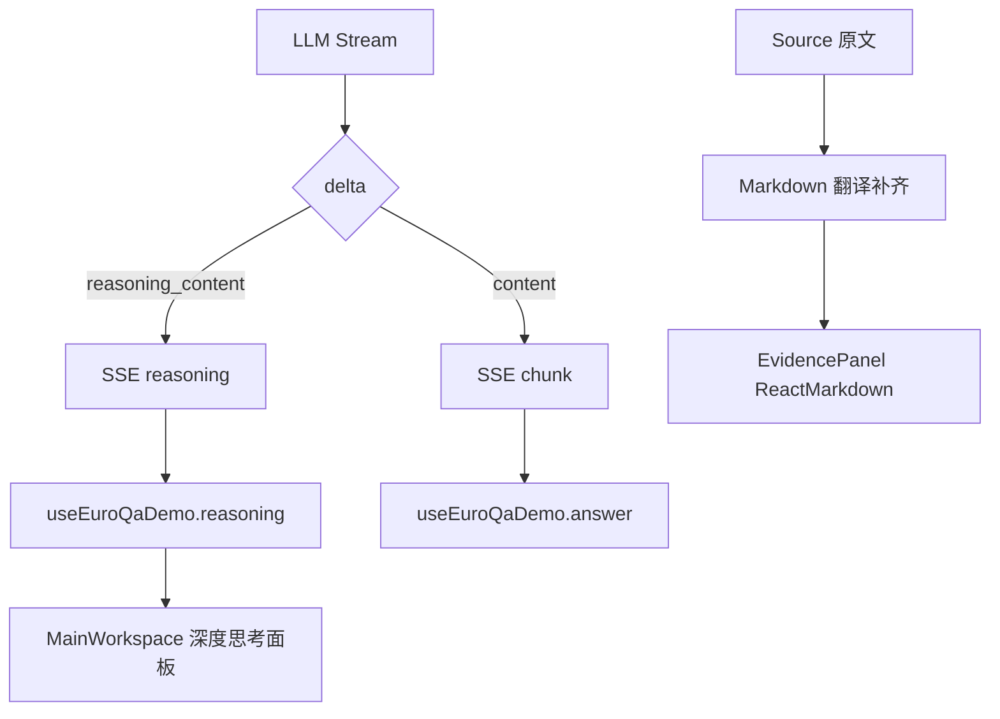

# 变更提案: thinking-panel-evidence-markdown

## 元信息
```yaml
类型: 新功能
方案类型: implementation
优先级: P1
状态: 已确认
创建: 2026-03-27
```

---

## 1. 需求

### 背景
当前问答页只有正式回答流，没有“深度思考”展示能力；而右侧“证据与溯源”面板中的中文解释区虽然已有全文翻译，但仍按纯文本展示。遇到表格、列表或条款枚举时，翻译结果缺少结构化排版，阅读体验较差。

### 目标
- 在主回答区上方新增一个默认折叠的“深度思考”面板，支持流式实时展示模型返回的 reasoning 内容。
- 保证 reasoning 为可选能力：模型返回则展示，不返回则静默降级，不影响正常回答。
- 将右侧“中文解释”升级为适合前端渲染的 Markdown 结构，使表格、列表和分段说明能被更好地展示。

### 约束条件
```yaml
时间约束: 本轮任务需在现有前后端结构上增量实现
性能约束: reasoning 为附加流，不得阻塞正式回答文本流；翻译仍需保持单次批量补齐
兼容性约束: 不支持 reasoning_content 的模型必须自动降级；现有无流式 fallback 路径需继续可用
业务约束: 中文解释必须严格基于 source 原文，不得补充原文未提供的信息
```

### 验收标准
- [ ] 流式回答过程中，若模型返回 reasoning 内容，前端在答案上方的折叠面板中实时展示，并在回答完成后保留完整记录。
- [ ] 若模型不返回 reasoning 内容，页面不报错、不出现异常占位，正常展示正式回答与来源。
- [ ] 右侧中文解释区支持 Markdown 渲染；表格、列表、段落能以结构化方式显示，纯文本内容保持正常段落展示。
- [ ] 现有流式 done payload 中的 sources、related_refs、confidence 行为保持兼容。

---

## 2. 方案

### 技术方案
采用“协议扩展 + 前端状态扩展 + 译文 Markdown 化渲染”的增量方案：

1. 后端在 `generate_answer_stream()` 中同时读取流式 token 的 `delta.reasoning_content` 和 `delta.content`，分别发出 `reasoning` 与 `chunk` 事件。
2. 前端 `queryStream()` 和 `useEuroQaDemo()` 扩展流式事件处理与消息状态，给每个 `ChatTurn` 新增 reasoning 字段。
3. 主回答区新增可折叠“深度思考”面板，默认折叠，仅在 reasoning 非空时展示。
4. source 翻译提示词升级为“优先输出 GFM Markdown”，要求表格尽量转 Markdown table，列表与条款转项目列表，普通说明保留自然段。
5. 右侧 `EvidencePanel` 复用 `ReactMarkdown + remark-gfm` 渲染中文解释，避免直接插入 HTML。

### 影响范围
```yaml
涉及模块:
  - server/core/generation.py: 扩展 reasoning 流事件与翻译提示词
  - server/api/v1/query.py: 透传新增 SSE 事件并维持会话写入逻辑
  - tests/server/test_generation.py: 增加 reasoning 流和 Markdown 翻译相关测试
  - frontend/src/lib/types.ts: 扩展 ChatTurn 与 stream payload 类型
  - frontend/src/lib/api.ts: 扩展 SSE 事件消费与回调接口
  - frontend/src/lib/api.test.ts: 增加 reasoning 事件解析测试
  - frontend/src/lib/session.ts: 支持 reasoning 字段持久化
  - frontend/src/lib/session.test.ts: 增加 reasoning 字段恢复测试
  - frontend/src/hooks/useEuroQaDemo.ts: 维护 reasoning 流式状态
  - frontend/src/components/MainWorkspace.tsx: 新增思考折叠面板
  - frontend/src/components/EvidencePanel.tsx: 中文解释改为 Markdown 渲染
预计变更文件: 10-11
```

### 风险评估
| 风险 | 等级 | 应对 |
|------|------|------|
| reasoning 字段在不同 OpenAI-compatible 服务中的兼容性不稳定 | 中 | 只做可选读取，有内容才发 `reasoning` 事件 |
| 翻译输出 Markdown 不稳定，可能出现半结构化文本 | 中 | 提示词明确优先 GFM；前端对纯文本和 Markdown 统一兼容 |
| 右侧证据面板引入 Markdown 后样式失控 | 低 | 复用主回答区的表格/列表样式思路，但限制在局部 class 内 |

---

## 3. 技术设计（可选）

> 涉及架构变更、API设计、数据模型变更时填写

### 架构设计


### API设计
#### POST /api/v1/query/stream
- **请求**: 保持不变
- **响应事件**:
  - `reasoning`: `{"text": "..."}`
  - `chunk`: `{"text": "...", "done": false}`
  - `done`: `{"sources": [...], "related_refs": [...], "confidence": "high|medium|low"}`

#### POST /api/v1/query
- **请求**: 保持不变
- **响应**: 保持结构不变；`sources[].translation` 优先返回 Markdown 友好内容

### 数据模型
| 字段 | 类型 | 说明 |
|------|------|------|
| ChatTurn.reasoning | string | 当前消息累计的深度思考文本 |
| reasoning SSE payload | `{text: string}` | reasoning 事件的增量文本 |
| Source.translation | string | 面向证据面板渲染的 Markdown 友好中文解释 |

---

## 4. 核心场景

> 执行完成后同步到对应模块文档

### 场景: 流式回答中的深度思考展示
**模块**: query stream / useEuroQaDemo / MainWorkspace
**条件**: 模型流式返回 reasoning 内容
**行为**: 后端发出 `reasoning` 事件，前端把增量文本累积到当前消息并展示在折叠面板中
**结果**: 用户可在正式回答上方查看完整思考过程

### 场景: 证据面板中的结构化中文解释
**模块**: generation / EvidencePanel
**条件**: source 原文包含表格、枚举或多段说明
**行为**: LLM 生成 Markdown 友好的中文解释，前端按表格、列表和段落渲染
**结果**: 右侧面板展示更易读的结构化中文解释

---

## 5. 技术决策

> 本方案涉及的技术决策，归档后成为决策的唯一完整记录

### thinking-panel-evidence-markdown#D001: 使用独立 reasoning SSE 事件而非混入回答文本流
**日期**: 2026-03-27
**状态**: ✅采纳
**背景**: reasoning 与正式回答属于不同语义流，前端需要分别展示与持久化。
**选项分析**:
| 选项 | 优点 | 缺点 |
|------|------|------|
| A: 独立 `reasoning` SSE 事件 | 协议清晰，前端状态简单，展示分离明确 | 需要扩展 SSE 处理逻辑 |
| B: reasoning 混入 `chunk` 文本 | 后端表面改动少 | 容易串流，前端解析脆弱 |
**决策**: 选择方案 A
**理由**: reasoning 是可选附加信息，独立事件最容易做到“有则展示、无则降级”，且不会污染正式回答文本。
**影响**: 影响 `server/core/generation.py`、`server/api/v1/query.py`、`frontend/src/lib/api.ts`、`frontend/src/hooks/useEuroQaDemo.ts` 和主回答区组件。

### thinking-panel-evidence-markdown#D002: 证据面板译文采用 Markdown 渲染，不直接渲染 HTML
**日期**: 2026-03-27
**状态**: ✅采纳
**背景**: 表格和列表需要结构化展示，但直接插入 HTML 会增加安全和样式风险。
**选项分析**:
| 选项 | 优点 | 缺点 |
|------|------|------|
| A: Markdown + `ReactMarkdown` | 安全边界清晰，可复用 GFM 表格/列表渲染 | 需要约束 LLM 输出 Markdown 风格 |
| B: 原始 HTML 渲染 | 表现力强 | 需要额外清洗和安全防护 |
**决策**: 选择方案 A
**理由**: 当前前端已经有稳定的 Markdown 渲染栈，沿用它能以最小风险支持表格、列表和段落。
**影响**: 影响翻译提示词设计和 `EvidencePanel.tsx` 的渲染方式。
