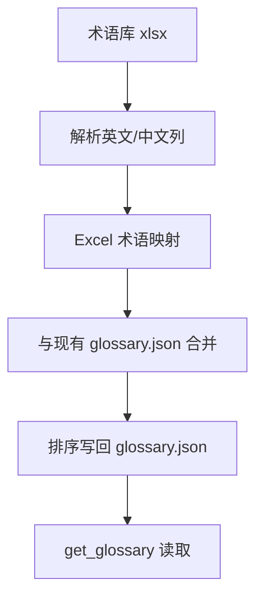

# 变更提案: glossary-sync-from-xlsx

## 元信息
```yaml
类型: 数据更新
方案类型: implementation
优先级: P1
状态: 已确认
创建: 2026-03-27
```

---

## 1. 需求

### 背景
现有术语表 [glossary.json](/Volumes/software/webdav/Euro_QA/data/glossary.json) 只包含一小部分中英对照词条，而你已经提供了更完整的 [术语库1.0-20260326.xlsx](/Volumes/software/webdav/Euro_QA/术语库1.0-20260326.xlsx)。查询理解层会直接读取该 JSON 做术语对齐，因此需要把 Excel 中的词条同步进去。

### 目标
- 将 Excel 中的术语导入为现有 `中文 -> 英文` 的 JSON 结构。
- 对同名中文术语，以 Excel 中的英文写法覆盖现有值。
- 对 Excel 未覆盖的旧词条继续保留，避免这次同步误删现有能力。

### 约束条件
```yaml
时间约束: 本轮直接基于现有文件完成更新
性能约束: 数据量较小，仅需保证 JSON 可被 get_glossary 正常读取
兼容性约束: 输出文件仍为 UTF-8 JSON，对现有后端和前端术语接口保持兼容
业务约束: Excel 作为同名覆盖源，未覆盖旧词条保留
```

### 验收标准
- [ ] `data/glossary.json` 成功更新为合并后的 `中文 -> 英文` 映射，JSON 语法合法。
- [ ] Excel 中 78 条唯一中文术语全部进入结果集；同名词条按 Excel 覆盖。
- [ ] 旧术语表中不在 Excel 的条目保留，不做删除。

---

## 2. 方案

### 技术方案
使用一次性导入脚本读取 xlsx 的 `Sheet1`，按表头中的“英文/中文”两列提取术语对照，生成 `中文 -> 英文` 映射后与现有 JSON 做保守合并：

1. 解析 Excel，提取所有有效 `(中文, 英文)` 术语对。
2. 以 Excel 为准构建新映射，若同一中文对应多个英文则视为冲突；本次预检结果为 0 冲突。
3. 在现有 `glossary.json` 上执行合并：Excel 同名覆盖，未覆盖旧项保留。
4. 结果按中文键排序写回，便于后续维护。

### 影响范围
```yaml
涉及模块:
  - data/glossary.json: 术语映射数据更新
  - server/deps.py: 继续按现有逻辑读取，不需要改代码
预计变更文件: 1
```

### 风险评估
| 风险 | 等级 | 应对 |
|------|------|------|
| Excel 词条与现有术语写法不一致（单复数差异） | 中 | 已提前检查变更项，按用户确认的“Excel 覆盖”执行 |
| 导入时误删旧有术语 | 低 | 采用保守合并，不做删除 |
| Excel 结构变化导致解析偏移 | 低 | 本次已确认仅一个 Sheet，且表头固定为“英文/中文” |

---

## 3. 技术设计（可选）

> 涉及架构变更、API设计、数据模型变更时填写

### 架构设计


### API设计
#### 数据文件更新
- **输入**: `术语库1.0-20260326.xlsx`
- **输出**: `data/glossary.json`

### 数据模型
| 字段 | 类型 | 说明 |
|------|------|------|
| glossary[中文] | string | 对应英文术语 |

---

## 4. 核心场景

> 执行完成后同步到对应模块文档

### 场景: Excel 术语库同步到运行时术语表
**模块**: data glossary / query understanding
**条件**: 提供标准格式的术语库 xlsx
**行为**: 从 Excel 提取术语并合并写回 `glossary.json`
**结果**: 后端术语接口与查询改写可直接使用更新后的词条

---

## 5. 技术决策

> 本方案涉及的技术决策，归档后成为决策的唯一完整记录

### glossary-sync-from-xlsx#D001: 采用保守合并，不删除 Excel 未覆盖的旧术语
**日期**: 2026-03-27
**状态**: ✅采纳
**背景**: 现有 `glossary.json` 中仍有部分 Excel 未覆盖的术语，若直接以 Excel 全量替换，可能导致当前查询能力退化。
**选项分析**:
| 选项 | 优点 | 缺点 |
|------|------|------|
| A: Excel 覆盖同名 + 保留旧有未覆盖项 | 风险低，不丢现有词条 | 最终词表不是“纯 Excel 来源” |
| B: 完全替换为 Excel | 来源单一，结果更纯 | 可能误删现有有效术语 |
**决策**: 选择方案 A
**理由**: 用户已经确认采用保守合并，这能在扩充词条的同时避免运行时回退。
**影响**: 只影响 `data/glossary.json` 的最终内容，不改接口与代码路径。
