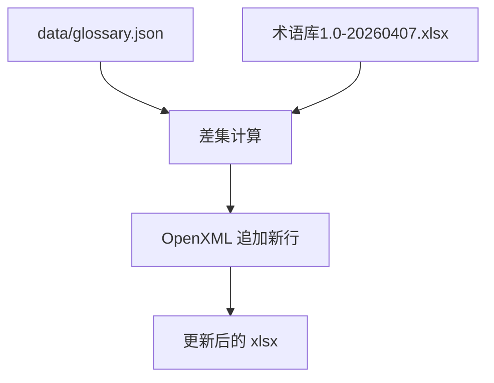

# 变更提案: glossary-xlsx-runtime-backfill

## 元信息
```yaml
类型: 数据更新
方案类型: implementation
优先级: P1
状态: 已确认
创建: 2026-04-11
```

---

## 1. 需求

### 背景
当前项目运行时术语表位于 [data/glossary.json](/Volumes/software/webdav/Euro_QA/data/glossary.json)，由 `server/deps.py` 在查询理解与术语接口中直接加载。你这次提供的外部术语库 [术语库1.0-20260407.xlsx](/Users/youngz/Downloads/术语库1.0-20260407.xlsx) 规模远大于运行时词表，但经过预检发现，运行时术语表中仍有 28 个中文词条未进入 Excel，同时 Excel 内部已有 13 组同名不同英文的冲突词条。为避免误改已有术语，本次应先把 Excel 中缺失的运行时词条补齐，而不是直接重写冲突项。

### 目标
- 将 `data/glossary.json` 中缺失于 Excel 的 28 个 `中文 -> 英文` 词条追加到 Excel。
- 保持现有表头和 6 列结构不变，仅在 `Sheet1` 末尾新增行。
- 对 Excel 中已存在但英文写法不同的 13 个冲突词条暂不覆盖，保留人工后续复核空间。

### 约束条件
```yaml
时间约束: 本轮直接基于现有仓库和用户提供的 Excel 完成
性能约束: 数据量小，允许使用一次性脚本处理
兼容性约束: 输出仍为 xlsx，保留 Sheet1、原表头和现有列顺序
业务约束: 只补缺失词条，不自动修复 Excel 内部冲突项；新增行默认补齐“所属专业=结构”，来源与翻译依据留空
```

### 验收标准
- [ ] `Sheet1` 成功追加 28 行缺失词条，原有 896 条数据行保留不变。
- [ ] 新增行的“英文”“中文”列与 `data/glossary.json` 一致，表头和列顺序不变。
- [ ] 对 Excel 已存在的 13 组同名冲突词条不做覆盖修改，并输出冲突清单供后续人工处理。

---

## 2. 方案

### 技术方案
使用一次性脚本直接处理 xlsx 的 OpenXML 结构：

1. 解析 `Sheet1`，读取表头、现有数据行和末行样式编号。
2. 加载 `data/glossary.json`，计算“运行时词表有、Excel 中没有”的差集。
3. 按现有列结构在末尾追加新行，仅填充 `序号 / 英文 / 中文 / 所属专业` 四列，沿用末行单元格样式。
4. 输出预检摘要：新增数量、跳过的冲突词条、最终总行数。

由于当前环境缺少现成的 xlsx 写库，本次不引入新依赖，直接在 XML 层做追加写入，降低环境耦合。

### 影响范围
```yaml
涉及模块:
  - /Users/youngz/Downloads/术语库1.0-20260407.xlsx: 追加缺失运行时词条
  - data/glossary.json: 作为对照源读取，不修改
  - .helloagents/plan/202604112019_glossary-xlsx-runtime-backfill/*: 记录方案与执行过程
预计变更文件: 2
```

### 风险评估
| 风险 | 等级 | 应对 |
|------|------|------|
| Excel 内部已有冲突词条，直接覆盖可能引入错误翻译 | 中 | 本次只追加缺失项，不覆盖冲突项 |
| 当前环境缺少 openpyxl 等库 | 中 | 使用 OpenXML 追加写入，不依赖外部库 |
| 外部文件位于工作区外，写回需要额外权限 | 中 | 先在工作区内验证逻辑，再请求授权写回原文件 |

---

## 3. 技术设计（可选）

> 涉及架构变更、API设计、数据模型变更时填写

### 架构设计


### 数据模型
| 字段 | 类型 | 说明 |
|------|------|------|
| 序号 | string | 追加行使用连续编号 |
| 英文 | string | 来自 `data/glossary.json` 的英文术语 |
| 中文 | string | 来自 `data/glossary.json` 的中文术语 |
| 所属专业 | string | 本次新增行固定填 `结构` |
| 英文术语来源 | string | 本次保持空白 |
| 中文术语翻译依据 | string | 本次保持空白 |

---

## 4. 核心场景

> 执行完成后同步到对应模块文档

### 场景: 运行时术语回填到主术语库
**模块**: data.glossary / external glossary xlsx
**条件**: `data/glossary.json` 含有 Excel 尚未收录的词条
**行为**: 计算差集并把缺失词条追加到 `Sheet1` 末尾
**结果**: 外部术语库补齐当前运行时使用的基础术语，不破坏 Excel 既有词条

---

## 5. 技术决策

> 本方案涉及的技术决策，归档后成为决策的唯一完整记录

### glossary-xlsx-runtime-backfill#D001: 本次只补缺失词条，不自动修复 Excel 内部冲突项
**日期**: 2026-04-11
**状态**: ✅采纳
**背景**: Excel 当前已有 13 组同名不同英文词条，若无人工语义判断直接批量覆盖，容易把已有术语进一步写乱。
**选项分析**:
| 选项 | 优点 | 缺点 |
|------|------|------|
| A: 只追加运行时缺失词条 | 风险低，结果可验证，不会放大现有冲突 | 13 组冲突词条仍需后续人工清理 |
| B: 同步覆盖所有同名词条 | 一次性对齐更彻底 | 容易错误覆盖 Excel 中更可信的现有写法 |
**决策**: 选择方案 A
**理由**: 用户当前只要求“更新术语库”，优先保证可逆、低风险和可验证；冲突修复应单独评审。
**影响**: 影响 Excel 新增 28 行，不改项目代码和运行时 JSON。
