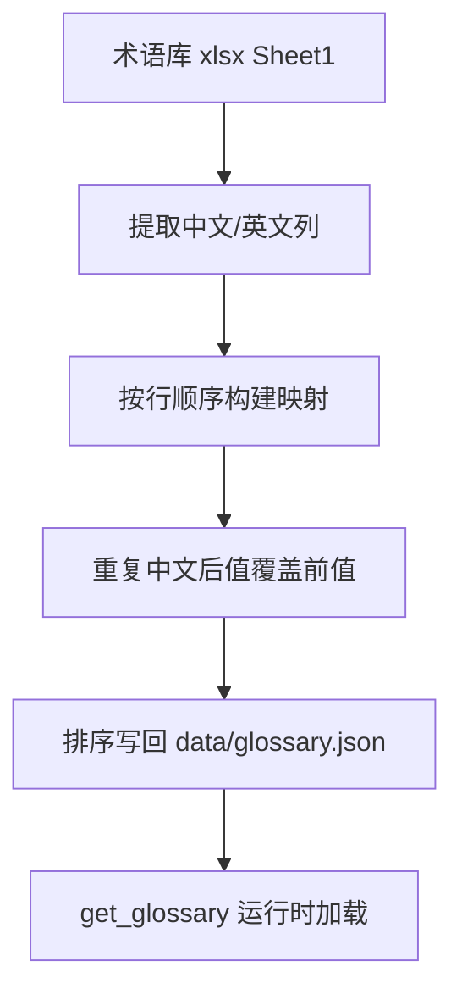

# 变更提案: glossary-json-from-xlsx

## 元信息
```yaml
类型: 数据更新
方案类型: implementation
优先级: P1
状态: 已确认
创建: 2026-04-11
```

---

## 1. 需求

### 背景
当前项目运行时术语表 [glossary.json](/Volumes/software/webdav/Euro_QA/data/glossary.json) 已不再作为主来源维护。你明确要求“直接按 xlsx 更新当前 JSON 术语库”，允许删除现有 JSON 中不在 xlsx 里的旧词条，因此本次要把 [术语库1.0-20260407.xlsx](/Users/youngz/Downloads/术语库1.0-20260407.xlsx) 直接转换为运行时使用的 `中文 -> 英文` JSON。

### 目标
- 只读取 xlsx 的 `Sheet1`
- 使用“中文”列作为 key，“英文”列作为 value
- 直接重建并覆盖 [glossary.json](/Volumes/software/webdav/Euro_QA/data/glossary.json)
- 不再保留旧 JSON 中未出现在 xlsx 的词条

### 约束条件
```yaml
时间约束: 本轮直接基于现有 xlsx 和仓库文件完成
性能约束: 数据量小，一次性转换即可
兼容性约束: 输出文件保持 UTF-8 JSON，结构仍为 `中文 -> 英文`
业务约束: xlsx 作为唯一来源；重复中文词条按表内后出现记录覆盖前值
```

### 验收标准
- [ ] `data/glossary.json` 被 xlsx 直接重建并可被现有 `get_glossary()` 正常读取
- [ ] 结果包含 `899` 个唯一中文术语（基于当前 xlsx 按“后出现覆盖前出现”计算）
- [ ] 旧 JSON 中未在 xlsx 出现的词条被移除，不再保留历史残留项

---

## 2. 方案

### 技术方案
使用一次性脚本直接解析 xlsx 的 OpenXML 内容，提取 `Sheet1` 中“中文/英文”两列，按行顺序构建映射，并采用“后出现覆盖前出现”的规则解决 13 组同名冲突词条。最终按中文键排序写回 `data/glossary.json`。

转换步骤:
1. 读取 xlsx 的 `Sheet1`
2. 跳过缺失中文或英文的空行
3. 对重复中文词条使用后行覆盖前行
4. 生成新的唯一术语映射
5. 覆盖写入 `data/glossary.json`
6. 验证 JSON 语法、词条数和若干关键冲突样本的最终取值

### 影响范围
```yaml
涉及模块:
  - data/glossary.json: 运行时术语表将被 xlsx 全量重建
  - server/deps.py: 继续按现有逻辑读取 JSON，无需改代码
  - .helloagents/plan/202604112032_glossary-json-from-xlsx/*: 记录本次转换方案与执行情况
预计变更文件: 2
```

### 风险评估
| 风险 | 等级 | 应对 |
|------|------|------|
| xlsx 内部存在 13 组同名不同英文词条 | 中 | 固定采用“后出现覆盖前出现”规则，保证转换确定性 |
| 旧 JSON 中部分历史词条会被移除 | 中 | 按用户明确要求执行，不做保守合并 |
| 环境缺少 openpyxl 等现成依赖 | 低 | 直接解析 OpenXML，无需新增依赖 |

---

## 3. 技术设计（可选）

> 涉及架构变更、API设计、数据模型变更时填写

### 架构设计


### 数据模型
| 字段 | 类型 | 说明 |
|------|------|------|
| glossary[中文] | string | 对应英文术语 |

---

## 4. 核心场景

> 执行完成后同步到对应模块文档

### 场景: xlsx 直接重建运行时术语表
**模块**: data.glossary
**条件**: 用户确认以 xlsx 作为唯一来源更新 JSON
**行为**: 从 `Sheet1` 提取术语并覆盖写入 `data/glossary.json`
**结果**: 项目运行时术语表与当前 xlsx 同步，不再保留旧 JSON 残留项

---

## 5. 技术决策

> 本方案涉及的技术决策，归档后成为决策的唯一完整记录

### glossary-json-from-xlsx#D001: xlsx 重复中文词条按后出现记录覆盖前值
**日期**: 2026-04-11
**状态**: ✅采纳
**背景**: 当前 xlsx 中存在 13 组同名中文、不同英文的记录。若不固定规则，转换结果不具确定性。
**选项分析**:
| 选项 | 优点 | 缺点 |
|------|------|------|
| A: 前值优先 | 保留首次出现的原始写法 | 不符合“按当前表继续编辑”的直觉 |
| B: 后值优先 | 结果确定，符合顺序覆盖的直接转换逻辑 | 若后值错误也会进入 JSON |
**决策**: 选择方案 B
**理由**: 你要求“就按照我的 xlsx 更新”，后值优先最接近表格最新人工编辑结果。
**影响**: 影响 13 组冲突词条在最终 JSON 中的取值。
