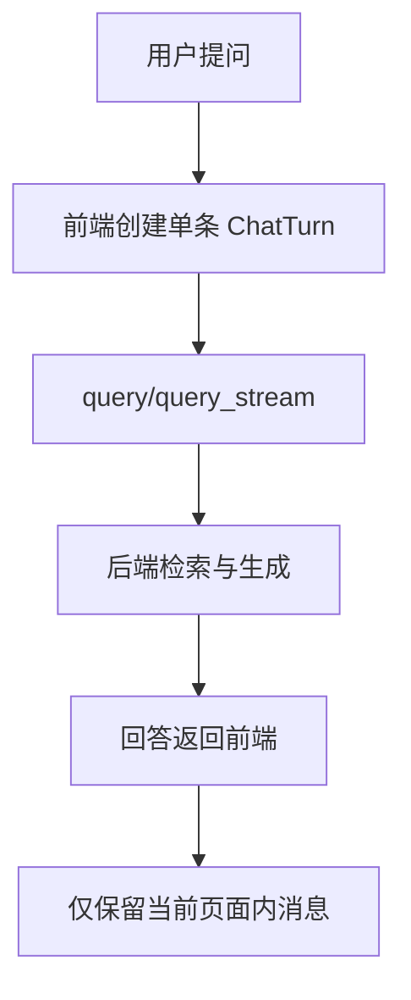

# 变更提案: remove-chat-history

## 元信息
```yaml
类型: 优化
方案类型: implementation
优先级: P1
状态: 已确认
创建: 2026-04-11
```

---

## 1. 需求

### 背景
当前系统同时存在两类“history”能力：
- 后端 `ConversationManager` 会缓存最近 3 轮问答，并在生成回答时注入 `conversation_history`
- 前端 `useEuroQaDemo` 会把当前会话序列持久化到 `localStorage`，并在侧边栏展示“最近提问”

你要求删除这套 history 机制，让每次问答都按独立对话处理，不再保留或恢复最近几轮会话内容。

### 目标
- 后端不再存放最近 3 轮问答，也不再把历史对话传给生成层
- 前端刷新页面后不再恢复旧会话
- 侧边栏不再显示“最近提问”历史区块
- 保留当前页面内的即时问答展示、文档选择、导出与新建会话按钮

### 约束条件
```yaml
时间约束: 本轮在现有前后端结构内直接完成，不引入新依赖
性能约束: 删除历史逻辑后不应增加额外请求或状态管理成本
兼容性约束: 保持现有 query/query_stream 协议字段兼容，避免连带破坏导出与引用展示
业务约束: 当前页内已显示的消息仍可连续查看，但后续问答不再依赖历史上下文
```

### 验收标准
- [ ] 后端 `query` 与 `query_stream` 不再读取或追加 conversation history，最近 3 轮缓存逻辑被移除
- [ ] 前端页面刷新后不会从 `localStorage` 恢复旧消息、草稿或引用定位状态
- [ ] 侧边栏不再展示“最近提问”及其本地记录提示
- [ ] 相关前后端测试覆盖上述行为，并在本轮验证中通过

---

## 2. 方案

### 技术方案
采用“前后端同时去 history 化”的单方案实现：

1. 后端保留 `conversation_id` 响应字段兼容，但移除实际历史状态的读写
2. `server/api/v1/query.py` 在普通与流式路径中都不再向生成层传递历史问答，也不再把本轮结果写回会话缓存
3. `server/core/conversation.py` 收敛为仅生成会话 ID 的轻量管理器，删除 `history` 数据结构和最近 3 轮截断逻辑
4. 前端 `frontend/src/lib/session.ts` 改为“禁用持久化”语义：读取始终返回 `null`，保存时清理旧 key，确保历史数据不会再被恢复
5. `frontend/src/hooks/useEuroQaDemo.ts` 不再以持久化结果初始化状态，并删除 `recentQuestions`
6. `frontend/src/components/Sidebar.tsx` / `frontend/src/App.tsx` 去掉“最近提问”展示链路

该方案不改主消息渲染与导出能力，只移除 history 相关状态来源。

### 影响范围
```yaml
涉及模块:
  - server/api/v1/query.py: 去掉历史问答注入与写回
  - server/core/conversation.py: 删除最近 3 轮缓存逻辑
  - frontend/src/lib/session.ts: 禁用本地会话持久化
  - frontend/src/hooks/useEuroQaDemo.ts: 去掉持久化恢复与 recentQuestions
  - frontend/src/components/Sidebar.tsx: 删除最近提问区块
  - frontend/src/App.tsx: 去掉 recentQuestions 传参
  - tests/server/test_api.py 与 frontend/src/lib/session.test.ts: 回归测试更新
预计变更文件: 7
```

### 风险评估
| 风险 | 等级 | 应对 |
|------|------|------|
| 误删 `conversation_id` 可能连带影响导出等现有功能 | 中 | 保留响应字段，仅删除历史读写 |
| 旧 localStorage 数据残留导致首屏仍恢复旧会话 | 中 | 保存时主动清理 key，读取直接返回 `null` |
| 侧边栏删历史后布局或交互出现空洞 | 低 | 仅删除该 section，保留现有文档/热门问题/术语区块结构 |

---

## 3. 技术设计（可选）

> 涉及架构变更、API设计、数据模型变更时填写

### 架构设计


### API设计
#### POST /api/v1/query
- **请求**: 继续兼容 `conversation_id`，但后端不再利用它读取历史上下文
- **响应**: 保持 `conversation_id` 字段，供前端现有导出/标识逻辑兼容使用

#### POST /api/v1/query/stream
- **请求**: 同上
- **响应**: `done` 事件不变，但不再触发服务端历史写回

### 数据模型
| 字段 | 类型 | 说明 |
|------|------|------|
| ConversationManager.history | 删除 | 不再缓存历史问答 |
| PersistedDemoSession | 保留类型但停用 | 读取恒为空，保存时只负责清理旧存储 |

---

## 4. 核心场景

> 执行完成后同步到对应模块文档

### 场景: 新提问不携带旧问答上下文
**模块**: server.api.v1.query / server.core.conversation
**条件**: 用户已发起过上一轮问答
**行为**: 再次提问时，后端只基于本轮问题与检索结果生成回答
**结果**: 新回答不再受最近 3 轮问答影响

### 场景: 刷新页面后不恢复旧会话
**模块**: frontend.lib.session / frontend.hooks.useEuroQaDemo / frontend.components.Sidebar
**条件**: 浏览器中存在旧 `euro_qa_demo_session`
**行为**: 页面重新加载
**结果**: 前端以空白会话启动，且侧边栏不再展示最近提问历史

---

## 5. 技术决策

> 本方案涉及的技术决策，归档后成为决策的唯一完整记录

### remove-chat-history#D001: history 功能按前后端双链路整体移除，而不是只关掉 UI
**日期**: 2026-04-11
**状态**: ✅采纳
**背景**: 当前“history”不仅体现在侧边栏展示，还体现在前端本地恢复和后端 prompt 注入。只删除某一个入口会造成行为残留，无法真正做到“每个对话独立”。
**选项分析**:
| 选项 | 优点 | 缺点 |
|------|------|------|
| A: 只删除侧边栏和 localStorage | 改动小，前端风险低 | 后端仍会保留最近 3 轮问答，不满足“独立对话” |
| B: 同时删除前端持久化和后端 history 注入 | 行为一致，语义完整 | 需要同步改前后端和测试 |
**决策**: 选择方案 B
**理由**: 用户要求的是功能语义上的“独立对话”，不是只隐藏展示入口，因此必须把状态持久化和生成链路里的历史依赖一起删除。
**影响**: 影响前端会话初始化、侧边栏展示、后端 query 编排和相关测试。
