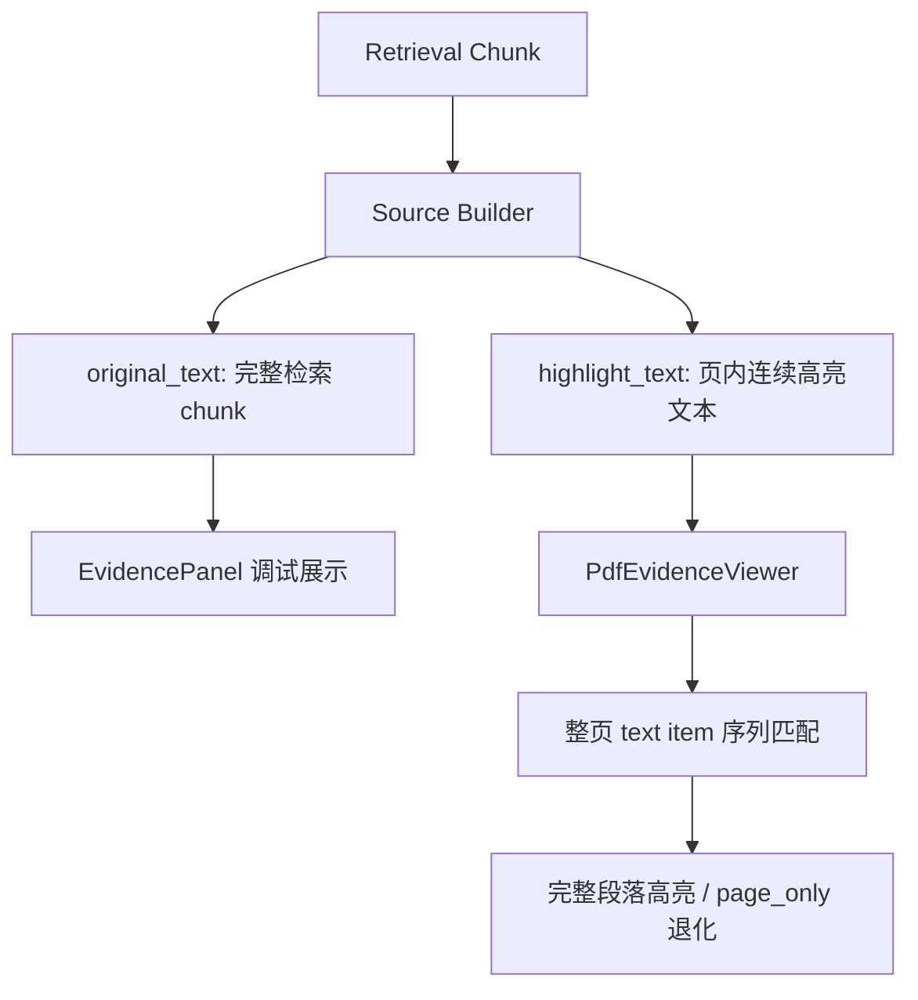

# 变更提案: pdf-full-chunk-highlight

## 元信息
```yaml
类型: 优化
方案类型: implementation
优先级: P0
状态: 已确认
创建: 2026-03-31
```

---

## 1. 需求

### 背景
当前右侧证据面板已经能展示完整检索 chunk，但 PDF 侧实际只使用从 chunk 派生出的截断 `locator_text` 做页内定位。因此用户看到的完整检索内容与 PDF 中的高亮片段并不一致，容易误解为系统没有按照检索块定位原文。

### 目标
- 前端右侧继续显示完整检索 chunk，便于调试和核对检索命中内容。
- PDF 查看器在目标页内尽可能对与该引用对应的完整连续段落做高亮，而不是仅高亮一个截断片段。
- 将“完整展示文本”和“PDF 高亮文本”拆成明确字段，避免前端继续混用 `original_text` 和 `locator_text`。

### 约束条件
```yaml
时间约束: 本轮内完成端到端实现与验证
性能约束: 不能显著增加 PDF 页渲染时延；高亮计算仅针对当前页执行
兼容性约束: 保留现有 page_only/error 退化路径，不破坏现有引用翻译与会话存储
业务约束: original_text 必须继续表示完整检索 chunk；完整高亮仅承诺在单页连续文本场景稳定成立
```

### 验收标准
- [ ] 右侧证据面板始终显示完整 `original_text` 检索 chunk，且不会再与 PDF 高亮字段混淆。
- [ ] 后端为 `Source` 提供独立的页内完整高亮文本字段，前端使用该字段驱动 PDF 高亮。
- [ ] 当引用对应的是目标页内连续文本段落时，PDF 查看器能对整段文本高亮；无法完整命中时仍正确回退到 `page_only`。
- [ ] 前后端相关测试和前端构建全部通过。

---

## 2. 方案

### 技术方案
采用“双轨文本字段 + 整段序列高亮”方案：

1. 后端保留 `original_text=完整检索 chunk`，新增 `highlight_text=目标页内完整高亮文本`。
2. `highlight_text` 不再简单取 chunk 前 240 字，而是从单页文本 chunk 中提取可在 PDF 文本层稳定命中的连续段落；对包含检索标记、表格占位符或多页内容的 chunk 做清洗与降级。
3. 前端 `PdfEvidenceViewer` 不再只对单个 text item 做包含判断，而是基于整页 text item 序列匹配 `highlight_text`，把整段命中的 item 全部高亮。
4. 右侧调试区域同时展示完整 chunk 和实际用于高亮的 `highlight_text`，便于核对“检索命中内容”与“PDF 定位文本”。

### 影响范围
```yaml
涉及模块:
  - server.models.schemas: 扩展 Source 数据模型
  - server.core.generation: 构建 highlight_text 并维持 original_text 的完整展示语义
  - frontend.src.lib.types: 对齐新的 Source 字段
  - frontend.src.lib.pdfLocator: 从单 item 命中升级为整段序列匹配
  - frontend.src.components.PdfEvidenceViewer: 基于整段匹配结果执行完整高亮
  - frontend.src.components.EvidencePanel: 展示完整 chunk 与高亮文本，保留调试视图
预计变更文件: 8-10
```

### 风险评估
| 风险 | 等级 | 应对 |
|------|------|------|
| 检索结果本身是多页或非连续块，无法严格映射为单页整段 | 高 | 后端生成 `highlight_text` 时显式限制为单页连续文本；不满足条件时退化为 `page_only` |
| PDF.js 文本层拆分方式与 Markdown chunk 文本差异较大 | 中 | 前端引入归一化后的整页序列匹配与 item 索引映射，并补针对性测试 |
| 新字段修改影响前后端类型与会话缓存 | 中 | 同步更新前端类型、测试夹具和 session/api 相关测试 |

---

## 3. 技术设计（可选）

> 涉及架构变更、API设计、数据模型变更时填写

### 架构设计


### API设计
#### POST /api/v1/query
- **请求**: 保持不变
- **响应**: `sources[].highlight_text` 新增为字符串字段，表示用于 PDF 完整高亮的页内文本

#### POST /api/v1/query/stream
- **请求**: 保持不变
- **响应**: `done` 事件中的 `sources[].highlight_text` 同步新增

### 数据模型
| 字段 | 类型 | 说明 |
|------|------|------|
| original_text | str | 完整检索 chunk，右侧调试与来源核对使用 |
| locator_text | str | 兼容保留，作为弱定位/回退字段 |
| highlight_text | str | 页内完整高亮文本，前端 PDF 高亮主字段 |

---

## 4. 核心场景

> 执行完成后同步到对应模块文档

### 场景: 查看完整检索 chunk 并在 PDF 中高亮对应段落
**模块**: server.core.generation / frontend.components.EvidencePanel / frontend.components.PdfEvidenceViewer
**条件**: 用户点击一个包含单页连续文本引用的来源
**行为**: 后端返回完整 `original_text` 与页内 `highlight_text`；右侧显示完整 chunk；PDF 跳到目标页并对 `highlight_text` 命中的整段文本高亮
**结果**: 用户能同时看到完整检索命中内容和 PDF 中对应的整段原文高亮

### 场景: 引用无法映射为单页连续文本
**模块**: server.core.generation / frontend.lib.pdfLocator
**条件**: 检索 chunk 为多页、包含表格占位符或在 PDF 文本层无法形成连续命中
**行为**: 后端生成尽力而为的高亮文本；前端匹配失败时回退为 `page_only`
**结果**: 页面仍定位正确，但不出现误导性的错误高亮

---

## 5. 技术决策

> 本方案涉及的技术决策，归档后成为决策的唯一完整记录

### pdf-full-chunk-highlight#D001: 分离完整检索文本与 PDF 完整高亮文本
**日期**: 2026-03-31
**状态**: ✅采纳
**背景**: 现有 `locator_text` 由完整 chunk 截断得到，只适合弱定位，不适合让用户把“完整检索命中内容”与“PDF 中真正高亮的文本”对齐理解。
**选项分析**:
| 选项 | 优点 | 缺点 |
|------|------|------|
| A: 新增独立 `highlight_text`，前端按整段序列高亮 | 语义清晰，完整 chunk 展示与 PDF 高亮职责分离，最符合需求 | 需要前后端一起改，测试面更大 |
| B: 直接拿 `original_text` 在前端整页硬匹配 | 后端改动少 | 对多页/非连续 chunk 脆弱，容易出现高亮失败或误高亮 |
**决策**: 选择方案 A
**理由**: 用户需要同时得到“完整检索块可见”和“PDF 中整段原文高亮”两种能力，而这两者在数据语义上并不相同。显式建模 `highlight_text` 是最稳妥且可验证的方式。
**影响**: 影响 Source schema、回答接口响应、PDF 高亮算法、证据面板调试视图与相关测试
