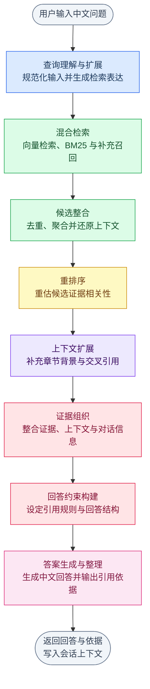

```mermaid
flowchart TD
    START(["用户输入中文问题"])

    %% ── Phase 1: 查询理解 ──
    START --> QUERY["查询理解与扩展<br/>规范化输入并生成检索表达"]

    %% ── Phase 2: 混合检索 ──
    QUERY --> RETRIEVE["混合检索<br/>向量检索、BM25 与补充召回"]
    RETRIEVE --> MERGE["候选整合<br/>去重、聚合并还原上下文"]

    %% ── Phase 3: 重排序 ──
    MERGE --> RERANK["重排序<br/>重估候选证据相关性"]

    %% ── Phase 4: 上下文扩展 ──
    RERANK --> CONTEXT["上下文扩展<br/>补充章节背景与交叉引用"]

    %% ── Phase 5: 证据组织 ──
    CONTEXT --> PROMPT["证据组织<br/>整合证据、上下文与对话信息"]
    PROMPT --> SYSTEM["回答约束构建<br/>设定引用规则与回答结构"]

    %% ── Phase 6: 回答生成 ──
    SYSTEM --> LLM["答案生成与整理<br/>生成中文回答并输出引用依据"]
    LLM --> END(["返回回答与依据<br/>写入会话上下文"])

    %% ── 样式 ──
    classDef phase1 fill:#dbeafe,stroke:#2563eb,color:#1e3a5f
    classDef phase2 fill:#dcfce7,stroke:#16a34a,color:#14532d
    classDef phase3 fill:#fef9c3,stroke:#ca8a04,color:#713f12
    classDef phase4 fill:#ede9fe,stroke:#7c3aed,color:#3b0764
    classDef phase5 fill:#ffe4e6,stroke:#e11d48,color:#881337
    classDef phase6 fill:#fce7f3,stroke:#db2777,color:#831843
    classDef io fill:#f1f5f9,stroke:#64748b,color:#334155

    class QUERY phase1
    class RETRIEVE,MERGE phase2
    class RERANK phase3
    class CONTEXT phase4
    class PROMPT,SYSTEM phase5
    class LLM phase6
    class START,END io
```
