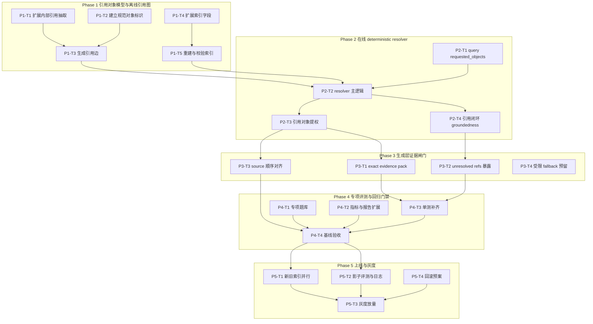

# 交叉引用解析专项 — 依赖图

```mermaid
flowchart TD
  subgraph P1[Phase 1 引用对象模型与离线引用图]
    P1T1[P1-T1 扩展内部引用抽取]
    P1T2[P1-T2 建立规范对象标识]
    P1T3[P1-T3 生成引用边]
    P1T4[P1-T4 扩展索引字段]
    P1T5[P1-T5 重建与校验索引]
  end

  subgraph P2[Phase 2 在线 deterministic resolver]
    P2T1[P2-T1 query requested_objects]
    P2T2[P2-T2 resolver 主逻辑]
    P2T3[P2-T3 引用对象提权]
    P2T4[P2-T4 引用闭环 groundedness]
  end

  subgraph P3[Phase 3 生成层证据闸门]
    P3T1[P3-T1 exact evidence pack]
    P3T2[P3-T2 unresolved refs 暴露]
    P3T3[P3-T3 source 顺序对齐]
    P3T4[P3-T4 受限 fallback 预留]
  end

  subgraph P4[Phase 4 专项评测与回归门禁]
    P4T1[P4-T1 专项题库]
    P4T2[P4-T2 指标与报告扩展]
    P4T3[P4-T3 单测补齐]
    P4T4[P4-T4 基线验收]
  end

  subgraph P5[Phase 5 上线与灰度]
    P5T1[P5-T1 新旧索引并行]
    P5T2[P5-T2 影子评测与日志]
    P5T3[P5-T3 灰度放量]
    P5T4[P5-T4 回滚预案]
  end

  P1T1 --> P1T3
  P1T2 --> P1T3
  P1T4 --> P1T5
  P1T3 --> P2T2
  P1T5 --> P2T2
  P2T1 --> P2T2
  P2T2 --> P2T3
  P2T2 --> P2T4
  P2T3 --> P3T1
  P2T4 --> P3T2
  P2T3 --> P3T3
  P3T1 --> P4T3
  P3T2 --> P4T3
  P3T3 --> P4T4
  P4T1 --> P4T4
  P4T2 --> P4T4
  P4T3 --> P4T4
  P4T4 --> P5T1
  P4T4 --> P5T2
  P5T1 --> P5T3
  P5T2 --> P5T3
  P5T4 --> P5T3
```

## 并行说明

- `P1-T1 / P1-T2 / P1-T4` 可先并行
- `P1-T3` 依赖对象抽取和对象标识
- `P2-T3 / P2-T4` 可在 resolver 主逻辑稳定后并行
- `P4-T1 / P4-T2 / P4-T3` 适合并行推进
- `P5-T1 / P5-T2 / P5-T4` 可并行准备，`P5-T3` 最后执行
