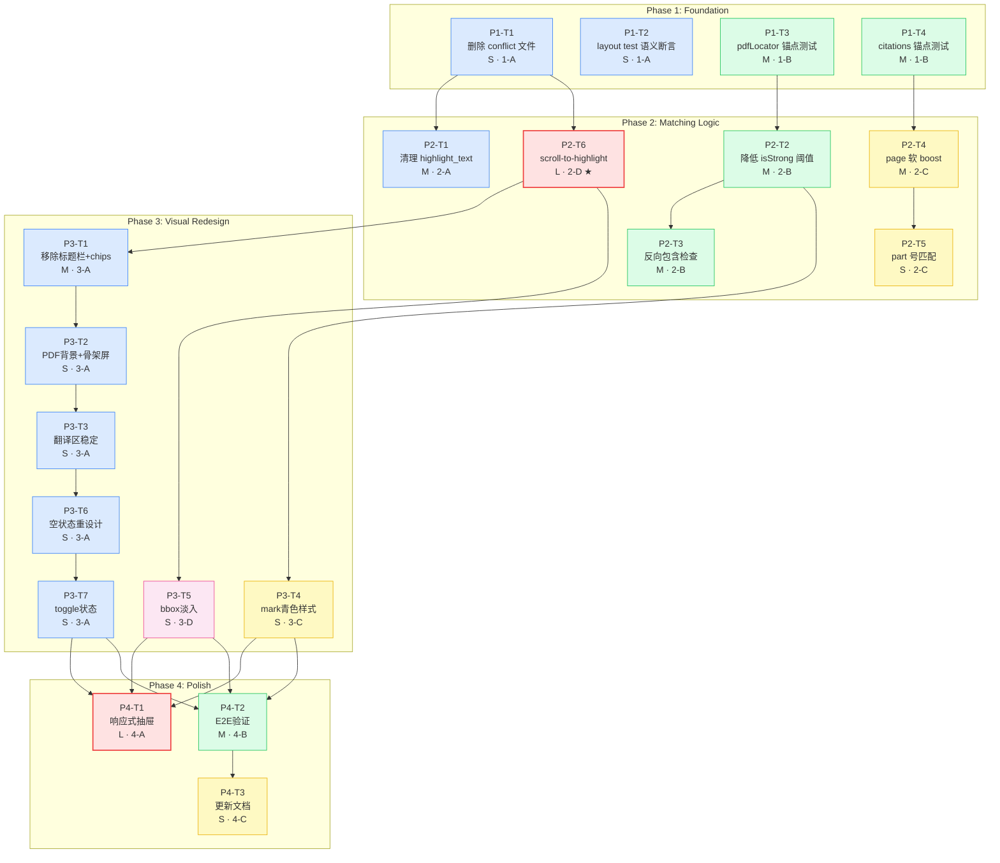

# PDF 证据面板优化 — 依赖关系图

## 整体依赖图



## 关键路径

```
P1-T3(3h) → P2-T6(6h) → P3-T1(3h) → P3-T2(1h) → P3-T3(1h) → P3-T6(1h) → P3-T7(1h) → P4-T2(2h)
```

**最小挂钟时间**: ~16h（Phase 1: 3h + Phase 2: 6h + Phase 3: 5h + Phase 4: 2h）

## 并行通道时间轴

```
Phase 1 (3h)
  1-A │ T1(S) │ T2(S) │
  1-B │ T3(M)         │ T4(M) │

Phase 2 (6h)
  2-A │ T1(M ~2h)              │
  2-B │ T2(M) │ T3(M)          │
  2-C │ T4(M ~2h) │ T5(S)      │
  2-D │ T6(L ~6h) ← 关键路径   │

Phase 3 (5h)
  3-A │ T1(M) │ T2(S) │ T3(S) │ T6(S) │ T7(S) │ ← 关键路径
  3-C │ T4(S)                                    │
  3-D │ T5(S)                                    │

Phase 4 (5h)
  4-A │ T1(L ~5h) ← 可选       │
  4-B │ T2(M ~2h)               │
  4-C │     T3(S)               │
```
