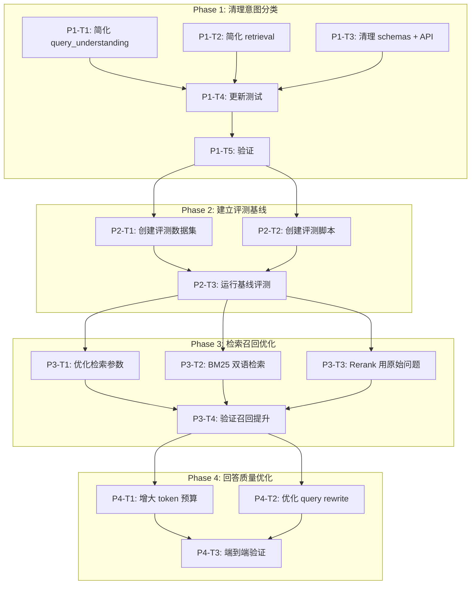

# 检索优化 — 依赖关系图

```mermaid
graph TD
    subgraph "Phase 1: 清理意图分类"
        P1T1["P1-T1: 简化 query_understanding"]
        P1T2["P1-T2: 简化 retrieval"]
        P1T3["P1-T3: 清理 schemas + API"]
        P1T4["P1-T4: 更新测试"]
        P1T5["P1-T5: 验证"]
        
        P1T1 --> P1T4
        P1T2 --> P1T4
        P1T3 --> P1T4
        P1T4 --> P1T5
    end
    
    subgraph "Phase 2: 建立评测基线"
        P2T1["P2-T1: 创建评测数据集"]
        P2T2["P2-T2: 创建评测脚本"]
        P2T3["P2-T3: 运行基线评测"]
        
        P2T1 --> P2T3
        P2T2 --> P2T3
    end
    
    subgraph "Phase 3: 检索召回优化"
        P3T1["P3-T1: 优化检索参数"]
        P3T2["P3-T2: BM25 双语检索"]
        P3T3["P3-T3: Rerank 用原始问题"]
        P3T4["P3-T4: 验证召回提升"]
        
        P3T1 --> P3T4
        P3T2 --> P3T4
        P3T3 --> P3T4
    end
    
    subgraph "Phase 4: 回答质量优化"
        P4T1["P4-T1: 增大 token 预算"]
        P4T2["P4-T2: 优化 query rewrite"]
        P4T3["P4-T3: 端到端验证"]
        
        P4T1 --> P4T3
        P4T2 --> P4T3
    end
    
    P1T5 --> P2T1
    P1T5 --> P2T2
    P2T3 --> P3T1
    P2T3 --> P3T2
    P2T3 --> P3T3
    P3T4 --> P4T1
    P3T4 --> P4T2
```
