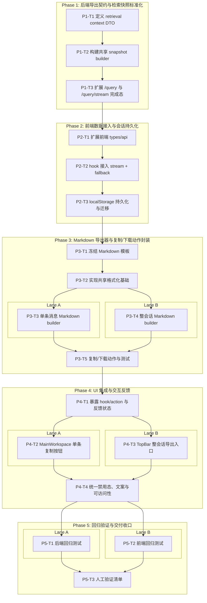

# LLM 回复复制与会话导出 Dependency Graph

## 说明

- 图中按阶段展示任务依赖关系
- 带 `Lane` 的 subgraph 表示可并行执行的任务组
- 无 lane 的阶段表示建议顺序执行

## 关键依赖解读

- `P1-T3 -> P2-T1`
  前端只有在后端完成新协议后，才能稳定接入 retrieval context。

- `P2-T3 -> P3-T1`
  Markdown 模板需要基于最终落库后的 `ChatTurn` 结构来定稿，否则后续 builder 会反复返工。

- `P3-T5 -> P4-T1`
  UI 集成应依赖稳定的导出器和动作层，而不是在组件里直接拼 Markdown。

- `P4-T4 -> P5-T1/P5-T2`
  自动化测试应在最终交互规则固定后补齐，避免测试围绕临时文案和禁用态频繁失效。

## 并行窗口

- Window 1:
  `P3-T3` 与 `P3-T4` 可并行
- Window 2:
  `P4-T2` 与 `P4-T3` 可并行
- Window 3:
  `P5-T1` 与 `P5-T2` 可并行

## 不建议并行的热点

- `frontend/src/hooks/useEuroQaDemo.ts`
  会同时承接 retrieval context 写入、动作暴露、UI 状态反馈，是实现期热点文件。

- `server/core/generation.py`
  会同时承接 snapshot builder 和完成态元数据，建议单人顺序修改。
