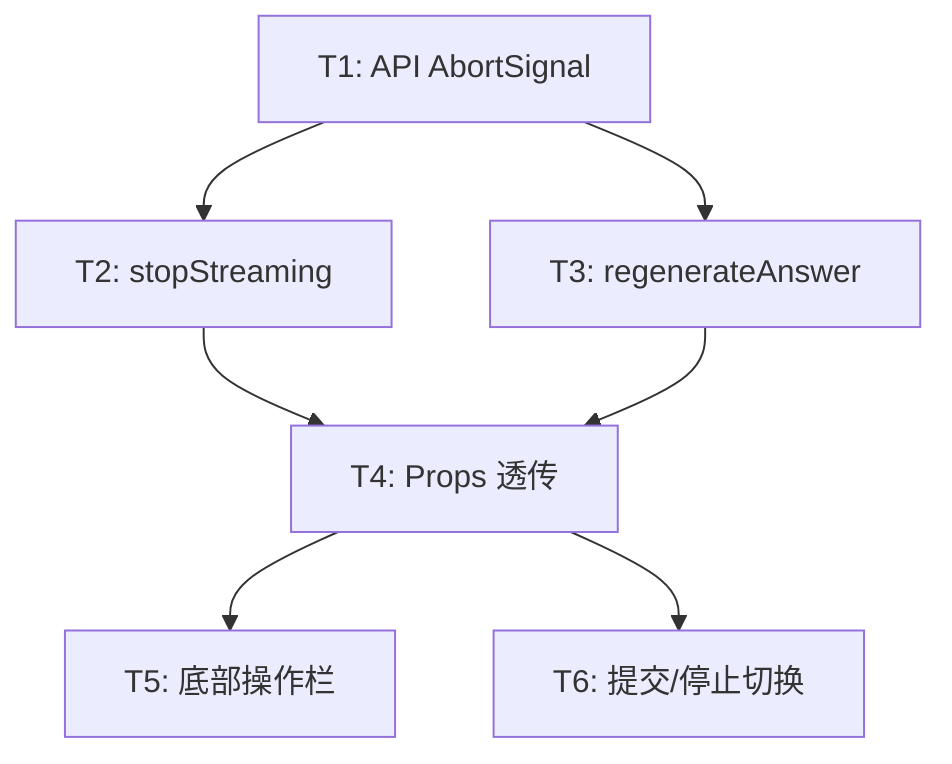

# Task Breakdown: Frontend Chat UX Features

## Phase 1: API 层支持中断 (1 task)

### T1: queryStream / readSseStream 添加 AbortSignal 支持
- **Priority**: P0 (blocker for stop feature)
- **Effort**: S
- **File**: `frontend/src/lib/api.ts`
- **Acceptance Criteria**:
  - `queryStream` 接受可选 `signal?: AbortSignal` 参数
  - `readSseStream` 接受可选 `signal?: AbortSignal`，在 read loop 中检查 `signal.aborted`
  - fetch 调用传入 signal
  - 被 abort 时抛出可识别的错误（区分网络错误和用户中断）

## Phase 2: Hook 层新增功能 (3 tasks, 可并行)

### T2: stopStreaming 功能
- **Priority**: P0
- **Effort**: S
- **File**: `frontend/src/hooks/useEuroQaDemo.ts`
- **Depends**: T1
- **Acceptance Criteria**:
  - 新增 `streamAbortControllerRef` ref
  - `askQuestion` 中创建 AbortController 并传 signal 给 queryStream
  - 新增 `stopStreaming()` 函数调用 abort
  - abort 后：保留已生成内容，status 设为 "done"，isSubmitting 设为 false
  - 导出 stopStreaming

### T3: regenerateAnswer 功能
- **Priority**: P0
- **Effort**: M
- **File**: `frontend/src/hooks/useEuroQaDemo.ts`
- **Depends**: T1
- **Acceptance Criteria**:
  - 新增 `regenerateAnswer(messageId: string)` 函数
  - 清空目标消息的 answer/reasoning/sources，status 设为 "streaming"
  - 用原问题重新调用 queryStream
  - 支持 AbortController（复用 stop 能力）
  - isSubmitting 期间禁止调用
  - 导出 regenerateAnswer

### T4: Props 透传
- **Priority**: P0
- **Effort**: S
- **File**: `frontend/src/App.tsx`
- **Depends**: T2, T3
- **Acceptance Criteria**:
  - MainWorkspace 新增 `onStop`, `onRegenerateAnswer` props
  - App.tsx 正确传入 demo.stopStreaming, demo.regenerateAnswer

## Phase 3: UI 改造 (2 tasks)

### T5: 回答底部操作栏
- **Priority**: P0
- **Effort**: M
- **File**: `frontend/src/components/MainWorkspace.tsx`
- **Depends**: T4
- **Acceptance Criteria**:
  - 删除标题行的「复制 Markdown」按钮
  - 在回答下方（sources 之后）添加操作栏
  - 包含：复制图标、重新生成图标
  - 仅 status="done" 时显示
  - 复制复用现有 handleCopyMessage，保留 feedback 动画
  - 重新生成调用 onRegenerateAnswer，isSubmitting 时 disabled

### T6: 提交/停止按钮切换
- **Priority**: P0
- **Effort**: S
- **File**: `frontend/src/components/MainWorkspace.tsx`
- **Depends**: T4
- **Acceptance Criteria**:
  - isSubmitting=true 时：提交按钮变为停止按钮（Square 图标，红色调）
  - 点击停止调用 onStop
  - isSubmitting=false 时：恢复原提交按钮
  - 无输入时提交按钮 disabled，但停止按钮始终可点

## Dependency Graph

Phase 2 的 T2/T3 可并行；Phase 3 的 T5/T6 可并行。
